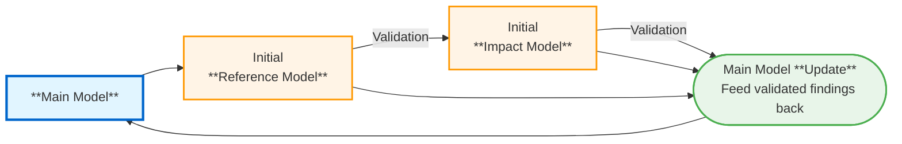
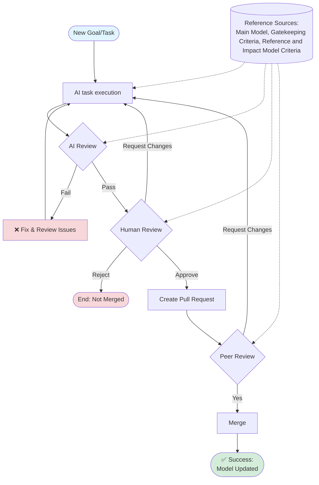

# Wirkmechanismen Workflow Documentation

## Overview

This document describes the complete workflow for managing and evolving the Wirkmechanismen factor network models. The workflow ensures scientific rigor, methodological consistency, and systematic validation through a structured gate-keeping and review process.

### Methodological Foundation: Design Research Methodology (DRM)

The Wirkmechanismen workflow implements the **Design Research Methodology (DRM)** framework by Blessing and Chakrabarti (2009), which provides a systematic approach to design research.

**Reference**: Blessing, L. T. M., & Chakrabarti, A. (2009). *DRM, a Design Research Methodology*. Springer. https://doi.org/10.1007/978-1-84882-587-1

**DRM Research Stages**:
1. **Research Clarification (RC)**: Define research goals, create initial Reference and Impact Models
2. **Descriptive Study I (DS-I)**: Understand existing situation, validate Reference Model empirically
3. **Prescriptive Study (PS)**: Develop support/intervention, design detailed Impact Model
4. **Descriptive Study II (DS-II)**: Evaluate impact of support, validate Impact Model through testing

Our workflow phases map directly to these DRM stages - see "DRM Research Stage Alignment" section below for detailed mapping.

## Core Principles

### 1. Main Model as Source of Truth
The [Wirkmechanismen Main Model](models/main_model/wirkmechanismen-main-model-blueprint.json) is the single source of truth representing consolidated knowledge about influencing factors in agile product development.

**Characteristics**:
- Comprehensive network of validated factors and relationships
- Continuously refined based on evidence
- Shared knowledge base across domains
- Naming conventions and factor definitions

**Evolution**: The Main Model grows through:
- Validated findings from Reference Models
- Confirmed interventions from Impact Models
- Literature reviews and expert interviews
- Incremental refinement of existing factors

### 2. Reference Models as Problem-Specific Extracts
Reference Models represent the **current state** for specific problems or domains.

**Purpose**:
- Focus on specific problem areas
- Establish baseline understanding
- Identify key intervention points
- Provide benchmark for impact assessment

**Source**: Scaffolded from Main Model with agentic support

### 3. Impact Models as Future-State Visions
Impact Models represent the **desired state** after introducing interventions (Supports).

**Purpose**:
- Test intervention hypotheses
- Model causal effects of supports
- Guide implementation planning
- Enable before/after comparison

**Source**: Derived from validated Reference Models

## Complete Workflow

### Workflow Overview


## Hybrid AI-Human Model Development Workflow



## Detailed Workflow Steps

### Phase 1: Main Model Change Management

**Trigger**: New factor, refined description, new causal relationship for Main Model

**Process**:
1. **Propose Change**: Draft the change (e.g., new factor, refined description, new causal relationship)
   - Formulate the proposed addition/modification
   - **NEW (V2)**: If new factor, provide:
     - `measurability` score (0, 0.5, or 1.0) with documented methodology
     - `influenceability` score (0, 0.5, or 1.0) with documented methodology
     - Rationale for distinction from existing factors (MECE check)
   - **NEW (V2)**: If new connection, explicitly specify:
     - Source factor (`from`)
     - Target factor (`to`)
     - Direction (`directed`/`undirected`/`mutual`)
     - Polarity (`++`, `+-`, `-+`, `--`)
     - Source attribution (`[A]`, `[E]`, `[O]`, or `[1-9]+`)

2. **Agentic Review** (Technical + Methodological Gate-Keeper):
   - **Technical validation**: JSON schema validation via `lint_blueprint.py`
   - **Structural checks**: Element/connection ID uniqueness, referential integrity
   - **AI/LLM semantic review** (per GATEKEEPING_CRITERIA_V2):
     - **NEW (V2)**: Developer confirmation status for all new connections
     - **NEW (V2)**: MECE analysis for new factors (overlap detection)
     - **NEW (V2)**: Verify quantitative attributes provided with methodology
     - Check compliance with [GATEKEEPING_CRITERIA_V2.md](GATEKEEPING_CRITERIA_V2.md)
     - DRM methodology compliance (attribute-of-element formulation)
     - Source attribution requirements (no `[?]` for merge-ready Main Model)
     - Causal plausibility assessment
     - Relevance to domain context
   - **Generate recommendation report** with:
     - **NEW (V2)**: Governance rule compliance status
     - **NEW (V2)**: Developer confirmation log
     - **NEW (V2)**: MECE analysis results
     - Issues and suggestions
   - **Blocking criteria** (V2):
     - New factor without both metrics (measurability + influenceability) → STOP
     - New factor with unclear MECE differentiation → Request clarification
     - New connection without developer confirmation → Request explicit confirmation
     - Merge-ready Main Model changes with `[?]` sources → REJECT
   - **Current implementation**:
     - Technical validation via pre-commit hook (automated)
     - Semantic review on-demand/manual (ask Claude/Codex with governance checklist)
   - **Future enhancement**: Fully integrated agent runs linter first, then performs governance + semantic analysis
3. **Human Review** (First Decision - Per Governance Requirements):
   - Verify all agentic review findings
   - **NEW (V2)**: Explicitly confirm or reject all developer-provided new connections
   - **NEW (V2)**: Validate MECE analysis and factor differentiation
   - **NEW (V2)**: Verify quantitative attributes have documented methodology
   - Review scientific plausibility of new factors/connections
   - Check evidence quality and source attribution
   - **NEW (V2)**: Confirm governance rule compliance
   - Decision: Approve for PR, Reject, or Request Changes\n4. **Create Pull Request**: After human approval, create feature branch and PR
   - Create feature branch: `git checkout -b feature/{description}`
   - Commit changes with descriptive message
   - Push and create PR: `git push -u origin feature/{description} && gh pr create`
5. **Peer Review** (Final Gate - Governance Enforcement):
   - Independent validation by domain expert via PR review
   - **NEW (V2)**: Cross-verify governance rule compliance (connections, MECE, metrics)
   - **NEW (V2)**: Verify developer confirmation log is complete
   - **NEW (V2)**: For Main Model changes: Ensure no `[?]` sources (merge-blocking)
   - **NEW (V2)**: For new factors: Verify MECE differentiation from existing factors
   - Verify all literature references (check actual sources)
   - Check model consistency and downstream impact
   - Final Decision: Approve for merge or Request Changes
6. **Merge**: Changes integrated into Main Model
   - Merge PR to main branch
   - Delete feature branch

**Quality Gates** (per GATEKEEPING_CRITERIA_V2):
- ✅ JSON schema validation passes
- ✅ DRM formulation compliance (100%, "attribute-of-element")
- ✅ Developer confirmation present for all new connections
- ✅ **NEW (V2)**: New factors have both metrics (measurability + influenceability)
- ✅ **NEW (V2)**: New factors have MECE differentiation from existing factors
- ✅ **NEW (V2)**: Quantitative attributes have documented methodology/source
- ✅ **NEW (V2)**: No `[?]` sources in merge-ready changes
- ✅ Source attribution for all connections (>90%)
- ✅ No contradictions with existing knowledge
- ✅ Peer review approval with governance sign-off

**Rejection Criteria**: See [GATEKEEPING_CRITERIA_V2.md](GATEKEEPING_CRITERIA_V2.md) Section 6 - Automatic Rejection Thresholds

---

### Phase 2: Reference Model Creation

**Trigger**: Specific problem or research question identified

**Process**:
1. **Problem Definition**:
   - Define problem scope and domain
   - Identify relevant factors from Main Model
   - Determine success factors and measurable proxies

2. **Agentic Scaffolding** (deterministic derivation per V6):
   - **Problem normalization**: Apply exact normalization (lowercase, diacritics, whitespace)
   - **Semantic candidate extraction**: Identify all semantically matching factors (min. score 0.5)
   - **Candidate filtering**: Build nested sets (C0 → C1 → C2) following factor proximity rules
   - **Key Factor selection**: Score candidates using V6 criteria, select primary with [PRIMARY] tag
   - **Success Factor selection**: Identify outcome nodes reachable within 4 directed connections
   - **Proxy selection**: If Success Factor measurability < 1.0, add measurable proxy with documentation
   - **Influencing Factor integration**: Select minimal set maintaining at least one complete Key→Success path
   - **Causal structure**: Build network with feedback loops explicitly justified
   - **Source attribution**: Maintain literature references, mark assumptions [A] where applicable
   - **Derivation logging**: Document all steps, scores, tie-breaks, and path validation
   - Save as `{domain}-reference-model.json` in `models/reference_models/`
   - Reference: [REFERENCE_MODEL_CRITERIA_V6.md](REFERENCE_MODEL_CRITERIA_V6.md) Section 3

3. **Human Review**:
   - Verify causal logic and completeness
   - Check that Key Factor is intervention-worthy
   - Validate literature sources
   - Assess model complexity (not too simple/complex)
   - Decision: Approve for Peer Review or Request Changes

4. **Peer Review**:
   - Independent expert validation
   - Topological integrity check (Key Factor = start node, Success Factor = end node)
   - Evidence coverage check (>75% literature sources)
   - Path completeness (at least one full path)
   - Final Decision: Validate or Reject

5. **Incremental Validation**:
   - Literature review to fill evidence gaps
   - Expert interviews to validate causal relationships
   - Update `[?]` or `[A]` sources with `[1-9]+` or `[E]`/`[O]`
   - Document validation in commit messages

6. **Status Update**: Mark model as "validated" (remove `-wip` suffix if present)

**Quality Gates** (per V6):
- ✅ At least ONE [PRIMARY] Key Factor (exactly one primary designation, optional secondaries)
- ✅ At least ONE Success Factor (multiple allowed for multi-dimensional goals)
- ✅ Measurable Success Factors with direct proxy relationships (if Success Factor measurability < 1.0)
- ✅ No fixed upper limit on Influencing Factors (but >10 requires complexity review)
- ✅ Primary Key Factor reaches at least one Success Factor (max 4 directed connections)
- ✅ Feedback loops explicitly justified with mechanism, time horizon, and feedback process
- ✅ >75% connections with literature sources `[1-9]+` (target ≥90%)
- ✅ All factors use "attribute-of-element" formulation (no value judgments in labels)
- ✅ No orphaned elements within topology
- ✅ Derivation log complete with all required details
- ✅ Peer review approval

**Outputs**:
- `models/reference_models/{domain}-reference-model.json`
- Commit: `[REFERENCE] Add {domain} reference model`

---

### Phase 3: Impact Model Creation

**Trigger**: Validated Reference Model + Intervention hypothesis

**Support Source Policy** (per V3):
1. **Primary source**: Validated support packages (if configured and available)
2. **Fallback source**: AI-generated support (if no package available or matching)
   - MUST be marked as `AI-generated support` in description
   - MUST include: target factors, mechanism, measurable metric (0/0.5/1.0), validation plan
3. **Derivation log**: Document which source path was used (package or fallback)

**Process**:
1. **Reference Model Freeze** (Step 1 of deterministic protocol):
   - Inherit all Key Factors, Success Factors, Measurable Success Factors, Influencing Factors
   - Inherit all unchanged RM connections with exact source attribution
   - Mark all inherited elements and connections for traceability
   - Preserve feedback loops if unchanged and causally valid

2. **Support Candidate Extraction** (Step 2 of deterministic protocol):
   - Build candidate set from controllable leverage points:
     - Primary target: Primary Key Factor
     - Secondary targets: First-hop Influencing Factors on valid RM paths
   - Reject candidates that restate outcomes instead of interventions

3. **Support Scoring** (Step 3 of deterministic protocol):
   - Score each candidate deterministically:
     - +3 directly actionable by team (1.0), +1.5 partial dependency (0.5), +0 external (0.0)
     - +2 mechanism specificity (action + target + direction) = 1.0; -0.5 incomplete; 0.0 abstract
     - +2 measurable implementation metric (binary/numeric), +1 qualitative, +0 none
     - -2 external dependencies, -2 duplicates existing support
   - Select top 1-3 supports by score
   - Document all scores and tie-break decisions (tolerance 0.01)
   - Reference: [IMPACT_MODEL_CRITERIA_V3.md](IMPACT_MODEL_CRITERIA_V3.md) Section 2.5

4. **Agentic Scaffolding**:
   - Add Support elements (element type: "Support") from scoring results
   - Create connections: Support → Key Factor (marked `[A]`)
   - New Influencing Factors allowed ONLY if:
     - Causally linked to at least one Support AND at least one RM factor
     - Marked as assumption `[A]`
     - Mechanism, measurement method, and validation plan documented
     - Otherwise: REJECT new factor
   - Mark all new/modified connections as assumptions `[A]` with justification
   - Document causal mechanisms and expected directional changes
   - Ensure at least one complete Support → Success Factor path remains
   - Apply [IMPACT_MODEL_CRITERIA_V3.md](IMPACT_MODEL_CRITERIA_V3.md) constraints
   - Save as `{domain}-impact-model.json` in `models/impact_models/`

3. **Human Review**:
   - Verify Support interventions are concrete and implementable
   - Check causal plausibility of Support → Key Factor relationships
   - Validate that Problem and Success Factor match Reference Model
   - Assess assumption quality and documentation
   - Decision: Approve for Peer Review or Request Changes

4. **Peer Review**:
   - Independent validation of intervention logic
   - Check Support coverage (all Key Factors addressed?)
   - Verify all new connections marked as `[A]` with justification
   - Topological integrity (Supports = start nodes)
   - Final Decision: Approve for Piloting or Reject

5. **Incremental Validation** (Critical Phase):
   - **Pilot Study**: Small-scale implementation
   - **Data Collection**: Measure Key Factor improvements
   - **Qualitative Evidence**: Interviews, observations
   - **Update Model**: `[A]` → `[O]` for confirmed relationships
   - **Iteration**: Refine Supports based on learnings

6. **Quantitative Validation** (Optional):
   - Before/after measurements
   - Control group comparisons
   - Statistical significance testing
   - Update: `[O]` → `[1-9]+` if published

7. **Feedback to Main Model**:
   - Integrate validated Support-relationships into Main Model
   - Document evidence quality
   - Share learnings across domains

**Quality Gates** (per V3):
- ✅ Derived from validated Reference Model (identical domain-scope)
- ✅ At least 1-3 Support elements present (concrete interventions, not abstract goals)
- ✅ All Supports are start nodes (no incoming connections)
- ✅ Each Support connected to at least one Key Factor
- ✅ All inherited RM connections retain exact source attribution
- ✅ All new/modified connections marked `[A]` with mechanism + validation plan
- ✅ At least one complete Support → Success Factor path (max 5 connections)
- ✅ New Influencing Factors satisfy all exception conditions (linked to Support + RM, documented)
- ✅ No orphaned Support elements
- ✅ Supports are actionable by team (influenceability = 1.0)
- ✅ Supports have measurable implementation metric (0/0.5/1.0)
- ✅ All `[A]` assumptions have documented validation plans
- ✅ Support source policy documented in derivation log
- ✅ Peer review approval

**Outputs**:
- `models/impact_models/{domain}-impact-model.json`
- Commit: `[IMPACT] Add {domain} impact model with {N} support interventions`
- Validation commits: `[IMPACT] Validate assumption for {connection} based on {pilot/study}`

---

## DRM Research Stage Alignment

This section maps the Wirkmechanismen workflow to the four main DRM research stages, clarifying how our phases implement the DRM framework.

### DRM Stage Overview

| DRM Stage | Purpose | Key Activities | Wirkmechanismen Phase |
|-----------|---------|----------------|----------------------|
| **RC** (Research Clarification) | Define research goals and scope | Create initial RM and IM, define success criteria | Reference/Impact Model Creation |
| **DS-I** (Descriptive Study I) | Understand existing situation | Validate RM through literature, interviews, observations | Reference Model Validation |
| **PS** (Prescriptive Study) | Develop intervention | Design support, refine IM, document assumptions | Impact Model Design |
| **DS-II** (Descriptive Study II) | Evaluate impact | Pilot support, measure effects, validate IM | Impact Model Validation |

### Detailed Stage Mapping

#### Research Clarification (RC)

**DRM Definition**: Initial stage where research goals are defined, the problem is clarified, and initial models are created.

**Wirkmechanismen Implementation**:
- **Phase**: Reference Model Creation (steps 1-2) + Impact Model Scaffolding (steps 1-4)
- **Activities**:
  - Define problem scope and domain
  - Identify relevant factors from Main Model
  - **NEW**: Apply deterministic derivation protocol (V6 Section 3):
    - Problem normalization with exact semantic matching
    - Candidate extraction using embedding similarity (min. 0.5)
    - Primary Key Factor selection with [PRIMARY] tag
    - Success Factor selection (at least one; multiples allowed)
    - Proxy creation if needed (measurable proxies for < 1.0 measurability)
    - Influencing Factor integration with path validation
  - Create initial Reference Model (existing situation)
  - **NEW**: Apply deterministic IM protocol (V3 Section 2.5):
    - Freeze inherited RM structure
    - Extract support candidates from controllable leverage points
    - Score supports deterministically (V3 criteria)
  - Create initial Impact Model (desired situation with planned supports)
  - Define preliminary success criteria and measurable proxies
  - Plan validation approach
  - **NEW**: Document all derivation steps in model logs

**Deliverables**:
- `{domain}-reference-model-wip.json` (draft with complete derivation log)
- `{domain}-impact-model-wip.json` (draft with support scoring documented)
- Research plan documented in commit messages
- **NEW**: Derivation logs with all protocol steps

**Quality Gate**: Human Review approval to proceed to DS-I

**NEW Checks** (V6 & V3):
- ✅ Deterministic protocol followed with complete documentation
- ✅ All semantic scoring recorded with tie-break decisions
- ✅ Derivation log includes all required metrics and path validation

---

#### Descriptive Study I (DS-I) - Understanding Current Situation

**DRM Definition**: Comprehensive study to understand and validate the existing situation depicted in the Reference Model.

**Wirkmechanismen Implementation**:
- **Phase**: Reference Model Validation (steps 3-5)
- **Activities**:
  - **Literature Review**: Find academic sources for causal relationships, reference key works
  - **Expert Interviews**: Gather stakeholder experiences `[E]`
  - **Observations/Case Studies**: Collect empirical evidence `[O]`
  - **Evidence Integration**: Update connections from `[?]` or `[A]` to `[1-9]+`, `[E]`, or `[O]`
  - **Context Validation**: Verify Reference Model polarity accurately reflects current situation (V6 Section 0)
  - **Model Refinement**: Adjust factors, relationships, or descriptions based on evidence
  - **NEW**: Document all evidence sources with full APA citations in connection descriptions

**Deliverables**:
- Validated Reference Model: `{domain}-reference-model.json`
- >75% connections with literature sources `[1-9]+` (target ≥90%)
- Documented evidence in connection descriptions (20-150 words per connection)
- Commits: `[REFERENCE] Add literature source [X] for {connection}`
- **NEW**: Validation report showing evidence sources and coverage

**Quality Gate**: Peer Review approval - Reference Model is now empirically grounded

**NEW Checks** (V6):
- ✅ All polarity decisions validated against current situation context
- ✅ No `[?]` sources remaining (all connections attributed)
- ✅ Evidence coverage metrics documented
- ✅ Derivation log preserved and peer-reviewed

---

#### Prescriptive Study (PS) - Designing Intervention

**DRM Definition**: Development of support/intervention based on findings from DS-I to address key factors.

**Wirkmechanismen Implementation**:
- **Phase**: Impact Model Design and Review (steps 1-4)
- **Activities**:
  - **Support Design**: 
    - Use validated Support packages (primary source, V3)
    - Fallback: AI-generated support if packages unavailable (must be marked as such)
    - Create concrete interventions (tools, methods, processes, NOT abstract goals)
  - **Support Scoring**: Apply deterministic V3 protocol:
    - Score each candidate with mechanism specificity, team actionability, measurability
    - Select top 1-3 by score with documented tie-breaks (tolerance 0.01)
    - Document support source path (package or fallback)
  - **Causal Modeling**: Define Support → Key Factor relationships, marked `[A]`
  - **Context-aware Polarity** (V3 Section 5.0):
    - Choose polarity based on desired post-intervention context
    - DO NOT mechanically copy RM polarity
    - Document deviations from RM polarity with rationale
  - **Assumption Documentation**: Mark all new relationships as `[A]` with:
    - Theoretical or empirical justification
    - Expected directional change
    - Validation plan (pilot, study, expert validation)
  - **Mechanism Explanation**: Document how each support is expected to work
  - **New Factor Management** (V3 Section 1.4):
    - Default: No new factors
    - Exception: Only support-driven factors with all conditions met:
      - Linked to at least one Support AND at least one RM factor
      - Marked [A] with mechanism, measurement method, validation plan
      - Otherwise: REJECT
  - **Implementation Planning**: Define how supports will be deployed and measured

**Deliverables**:
- Detailed Impact Model: `{domain}-impact-model.json` (may still have `-wip`)
- Support elements with clear descriptions (source, target, mechanism, metric, validation)
- **NEW**: Support scoring results with all candidates and scores documented
- All new connections marked `[A]` with full justifications
- Validation plan for each assumption
- **NEW**: Derivation log with support source path and scoring tie-breaks
- Commits: `[IMPACT] Add {N} support interventions targeting {key factors}`

**Quality Gate**: Peer Review approval - Impact Model is theoretically sound and ready for testing

**NEW Checks** (V3):
- ✅ Support source policy documented (package or fallback)
- ✅ Support scoring complete with all tie-break decisions
- ✅ All polarity choices context-aware and documented
- ✅ 100% of `[A]` connections have documented justification + validation plans
- ✅ New factors satisfy all exception conditions (linked, documented, measurable)
- ✅ Developer confirmation present for all new connections

---

#### Descriptive Study II (DS-II) - Evaluating Impact

**DRM Definition**: Empirical evaluation of the support's impact by comparing actual outcomes to the Impact Model's predictions.

**Wirkmechanismen Implementation**:
- **Phase**: Impact Model Piloting and Validation (steps 5-7)
- **Activities**:
  - **Pilot Implementation**: Deploy supports in small-scale setting
  - **Before/After Measurement**: Measure key factors pre- and post-intervention
  - **Qualitative Evidence**: Conduct interviews and observations
  - **Hypothesis Testing**: Compare actual vs. expected causal effects
  - **Assumption Validation**:
    - Confirmed relationships: Change `[A]` → `[O]` (own investigation)
    - With literature evidence: Change `[A]` → `[1-9]+` (published sources)
    - Unconfirmed/blocked: Document blockers, keep as `[A]` with clear documentation
  - **Model Updates**: Reflect validation results in updated Impact Model
  - **Iteration**: Refine supports based on pilot learnings
  - **Quantitative Validation** (optional): Larger-scale controlled studies

**Deliverables**:
- Empirically validated Impact Model: `{domain}-impact-model.json` (finalized)
- Evidence of pilot results (data, interview summaries, validation reports)
- Updated connections: `[A]` → `[O]` or `[1-9]+` for confirmed relationships
- **NEW**: Derivation log tracking validation progress and evidence collection
- Commits: `[IMPACT] Validate assumption for {connection} based on {pilot/study}`
- Validation report or summary with validation methodology

**Quality Gate**: Empirical evidence confirms (or documents blockers for) assumptions

**Validation Target**: ≥75% of assumptions validated through pilots or studies

**Feedback Loop**: Validated support-relationships integrated into Main Model with evidence sources

**NEW Quality Checks** (V3):
- ✅ All `[A]` connections either validated or documented with blockers
- ✅ Polarity decisions stand after empirical testing (or adjusted with documentation)
- ✅ Support effectiveness measured and recorded
- ✅ Derivation log tracks all validation activities and results

---

### DRM Stage Progression Workflow

```
┌──────────────────────────────────────────────────────────────┐
│                    DRM RESEARCH CYCLE                        │
└──────────────────────────────────────────────────────────────┘

RC: Research Clarification
│
├─ Activity: Define problem and scope
├─ Output: Initial Reference Model (draft)
├─ Output: Initial Impact Model (draft)
└─ Decision: Proceed to DS-I
    │
    ↓
DS-I: Descriptive Study I (Understand Current State)
│
├─ Activity: Literature review
├─ Activity: Expert interviews
├─ Activity: Case studies / observations
├─ Output: Validated Reference Model (>75% literature coverage)
└─ Decision: Proceed to PS
    │
    ↓
PS: Prescriptive Study (Design Intervention)
│
├─ Activity: Design support interventions
├─ Activity: Model expected causal effects
├─ Activity: Document assumptions [A]
├─ Output: Detailed Impact Model with supports
└─ Decision: Proceed to DS-II
    │
    ↓
DS-II: Descriptive Study II (Evaluate Impact)
│
├─ Activity: Pilot implementation
├─ Activity: Before/after measurement
├─ Activity: Validate assumptions [A] → [O]
├─ Output: Empirically validated Impact Model
└─ Decision: Integrate findings into Main Model
    │
    ↓
Main Model Update: Consolidate validated knowledge
```

### Using DRM Stages in Practice

**For Researchers**:
1. **Start with RC**: Clearly define your research question and scope before creating models
2. **Don't skip DS-I**: Validate your Reference Model with evidence before designing interventions
3. **Be explicit in PS**: Document all assumptions - they will be tested in DS-II
4. **Measure in DS-II**: Plan measurement criteria during PS, execute during DS-II

**For Reviewers**:
- **RC Review**: Check clarity of research goals and model scope
- **DS-I Review**: Verify evidence quality and coverage
- **PS Review**: Assess intervention logic and assumption quality
- **DS-II Review**: Validate empirical methods and evidence interpretation

**Commit Message Tagging** (Optional):
```
[REFERENCE|RC] Initial reference model for {domain}
[REFERENCE|DS-I] Add literature evidence for {connections}
[IMPACT|RC] Initial impact model with {N} supports
[IMPACT|PS] Refine support design based on review
[IMPACT|DS-II] Validate assumptions from pilot study
```

---

## Review Process Details

### Critical Governance Rules (per V2)

**MANDATORY Rules**:
1. **Developer Confirmation for New Connections** (V2, Section 3.3):
   - NEW connections (including `from`, `to`, direction, `connection type`) MUST NEVER be autonomously set by AI system
   - EVERY new connection MUST be explicitly provided or confirmed by developer
   - AI system MUST actively request confirmation if not provided
   - REJECT any connection lacking developer confirmation

2. **Main Model Growth Governance** (V2, Section 4.4):
   - MECE Check: New factors MUST be checked for semantic overlap with existing factors
   - If overlap exists: split/merge decision and rationale MUST be documented
   - New factors SHOULD improve practical MECE quality
   - REJECT: Duplicate factors without explicit consolidation decision
   - MANDATORY: Both `measurability` and `influenceability` scores (0/0.5/1.0) explicitly provided
   - MANDATORY: Documented methodology/source for quantitative attributes

3. **Context-sensitive Polarity** (V6 Section 0, V3 Section 5.0):
   - Polarity MUST reflect actual model context (current for RM, desired for IM)
   - DO NOT mechanically copy Main Model polarity
   - If Main Model polarity misrepresents RM/IM context: MUST adjust and document rationale
   - ALLOWED: Adopt Main Model polarity ONLY if source-supported AND accurately represents context
   - REVIEW REQUIRED: Deviations from Main Model polarity require explanation in `description`

---

### 1. Agentic Review (Technical + Methodological Gate-Keeper)

**Purpose**: Comprehensive quality assessment combining automated validation and AI/LLM reasoning

**Components**:

#### A. Technical Validation (Automated)
**Tools**: `scripts/lint_blueprint.py` - JSON schema validation

**Checks**:
- JSON syntax correctness
- Schema compliance
- Element/connection ID uniqueness
- Referential integrity (from/to IDs exist)
- All connections have source attribution (no unattributed connections)
- DRM polarity validation (`++`, `+-`, `-+`, `--`)
- Direction values validity (`directed`, `undirected`, `mutual`)

**Output**: Pass/Fail with error messages

**Decision**: Automatically block commit/merge if validation fails

**Current State**: Implemented via pre-commit hook

#### B. Semantic & Methodological Review (AI/LLM Agent)
**Purpose**: Deep reasoning about model quality, DRM compliance, and governance rule enforcement

**Current Implementation**: Manual/on-demand (e.g., asking Claude/Codex to review factors or models)

**AI agent checks** (per GATEKEEPING_CRITERIA_V2):
- DRM methodology compliance (attribute-of-element formulation, no values in labels)
- Factor formulation quality and precision
- Source attribution completeness (no `[?]` sources for merge-ready Main Model changes)
- Topological integrity (causal logic, connectivity requirements)
- Relevance to domain context
- Causal plausibility assessment
- **NEW**: Consistency with context-sensitive polarity rules
- **NEW**: MECE check for new Main Model factors (overlap detection)
- **NEW**: Developer confirmation status for all new connections
- **NEW**: Quantitative attribute documentation (methodology/source)
- Consistency with existing model knowledge

**Output**: Recommendation report with:
- ✅ Pass/❌ Fail for each criterion
- **NEW**: Governance rule compliance status
- **NEW**: Developer confirmation log for new connections
- **NEW**: MECE analysis for new factors
- **NEW**: Context-sensitive polarity assessment
- List of issues to address
- Suggestions for improvement
- Contextual explanations and reasoning

**Decision**: Recommend approval, changes, or rejection (advisory to Human Review)

**BLOCKING CRITERIA** (must fail before merge):
- Any new connection without developer confirmation → STOP and request confirmation
- Merge-ready Main Model changes with `[?]` sources → REJECT
- New Main Model factor without both metrics (measurability + influenceability) → REJECT
- New Main Model factor without minimum connectivity (≥1 incoming, ≥1 outgoing) → REJECT
- Polarity mismatch with inadequate documentation → REVIEW REQUIRED

**Future Enhancement**: Agent automatically invokes linter (part A) as first step, then performs semantic analysis (part B) - fully integrated via pre-commit hook or GitHub Action

### 2. Human Review

**Purpose**: Expert assessment of scientific validity, practical utility, and governance compliance

**Responsibilities**:
- Verify all agentic review findings
- **NEW**: Explicitly confirm acceptance or rejection of developer-provided connections
- **NEW**: Validate MECE analysis for new Main Model factors
- **NEW**: Verify context-sensitive polarity decisions and documentation
- Verify causal logic and theoretical grounding
- Assess literature quality and relevance (check actual references)
- Check practical implementability (for Impact Models)
- Validate measurement approaches and quantitative attributes
- Ensure clarity and precision of descriptions
- **NEW (V2 Section 3.3)**: Confirm that all new connections have explicit developer confirmation

**Decision Authority**: Approve, Request Changes, or Reject

**BLOCKING CHECKS**:
- If agentic review found governance violations → request clarification/correction
- If any new connection lacks developer confirmation → STOP and request explicit confirmation
- If new Main Model factor missing metrics or connectivity → REJECT

**Documentation**: Code review comments on GitHub PR or commit, including governance compliance checklist

### 3. Peer Review

**Purpose**: Independent validation, final quality gate, and governance enforcement

**Responsibilities**:
- Independent verification of all agentic and human review points
- **NEW**: Cross-verify governance rule compliance (connections, MECE, polarity, metrics)
- **NEW**: Verify developer confirmation log completeness
- Cross-check all literature references (validate actual sources)
- Validate evidence quality and completeness
- Assess downstream impact on model ecosystem
- **NEW**: For Main Model changes: ensure no `[?]` sources (merge-blocking)
- **NEW**: For new factors: verify MECE differentiation from existing factors
- Final approval for merge/validation status

**Decision Authority**: Final Approve or Reject (binding)

**ESCALATION TRIGGERS**:
- Contradictory evidence → Scientific Advisory required
- Novel theoretical contributions → Expert review required
- Significant model restructuring → Governance review required
- Cross-domain factor integration → Domain expert agreement required

**Documentation**: PR approval or rejection with detailed comments, including governance compliance sign-off

---

## Quality Metrics and Monitoring

### Model Health Indicators (per GATEKEEPING_CRITERIA_V2)

Track these metrics for each model:

| Metric | Target | Measurement |
|--------|--------|-------------|
| Evidence Coverage | >90% | Percentage of connections with documented sources (not `[?]`) |
| Literature Coverage | >75% (Reference) / >50% (Impact) | Percentage of connections with literature references `[1-9]+` |
| Assumption Ratio | <30% (Impact Models) | Percentage of connections marked `[A]` |
| Factor Precision | 100% | Compliance with "attribute-of-element" formulation |
| Network Connectivity | <5% | Percentage of orphaned elements |
| Topological Integrity | 100% | Reference: Key Factor → Success Factor; Impact: Support → Success Factor |
| **NEW: MECE Quality** | >85% | New factors have distinct differentiation (no semantic overlap) |
| **NEW: Developer Confirmation** | 100% | All new connections have explicit developer confirmation |
| **NEW: Quantitative Documentation** | 100% | New Main Model factors have methodology/source for metrics |
| **NEW: Governance Compliance** | 100% | Polarity context-aware, no governance violations |

### Automatic Rejection Thresholds (per GATEKEEPING_CRITERIA_V2)

**BLOCKING CRITERIA** (automatic REJECT/STOP):
- Any JSON schema violation → **AUTOMATIC REJECT**
- >10% factors with invalid formulation (not "attribute-of-element") → **REJECT**
- >25% connections without source attribution → **REJECT**
- >50% assumptions without documentation → **REJECT**
- Any circular references in element/connection IDs → **REJECT**
- **NEW**: Merge-ready Main Model changes with `[?]` sources → **AUTOMATIC REJECT**
- **NEW**: New influencing factor without both metrics (measurability + influenceability) → **AUTOMATIC REJECT**
- **NEW**: New influencing factor without minimum connectivity (>=1 incoming, >=1 outgoing) → **AUTOMATIC REJECT**
- **NEW**: New connection without developer confirmation → **STOP and request confirmation**
- **NEW**: New Main Model factor with MECE overlap (no clear differentiation) → **REJECT**

---

## File Organization

```
models/
├── main_model/
│   └── wirkmechanismen-main-model-blueprint.json  # Source of truth
├── reference_models/
│   ├── {domain}-reference-model.json              # Validated reference models
│   └── {domain}-reference-model-wip.json          # Work-in-progress
└── impact_models/
    ├── {domain}-impact-model.json                 # Validated impact models
    └── {domain}-impact-model-wip.json             # Work-in-progress
```

**Naming Conventions**: See [NAMING_CONVENTIONS.md](NAMING_CONVENTIONS.md)

---

## Version Control and Git Workflow

### Commit Message Format

```
[MODEL_TYPE] Brief description

Detailed explanation:
- What changed
- Why it changed
- Evidence sources (if applicable)
- Validation status (if applicable)
```

**Examples**:
```
[MAIN] Add "Präzision der adressierten Probleme" factor

Added new factor distinguishing problem discovery (why/what) from
refinement execution (how). Based on Opportunity Canvas framework
and validated through expert interviews [E].

[REFERENCE] Add backlog-refinement quality reference model

Scaffolded from main model following strict topology requirements.
Includes 5 factors with >80% literature coverage.

[IMPACT] Validate assumption for backlog-refinement support

Pilot study with 3 teams confirmed that moderation guidelines improve
refinement quality. Updated connection from [A] to [O] with pilot data.
```

### Branch Strategy (Optional)

**For Main Branch Development**:
- Direct commits for minor refinements
- Feature branches for major restructuring

**For PR-Based Workflow**:
```
main (protected)
├── feature/{domain}-reference-model
├── feature/{domain}-impact-model
└── refactor/{description}
```

**Merge Process**:
1. Create feature branch
2. Make changes and commit
3. Push branch: `git push -u origin feature/{name}`
4. Create PR: `gh pr create` (after `gh auth login`)
5. Agentic + Human + Peer Review
6. Merge to main
7. Delete feature branch

---

## Validation Status Tracking

### Status Levels

| Status | Meaning | Indicator |
|--------|---------|-----------|
| Draft | Initial scaffolding | `-wip` suffix in filename |
| Human Reviewed | Passed initial review | Commit with `[REVIEW]` tag |
| Peer Validated | Ready for use/piloting | Standard filename (no `-wip`) |
| Empirically Validated | Pilot-tested (Impact Models) | Commit: `[IMPACT] Validate assumption...` |
| Production | Integrated into Main Model | Present in `main_model/` |

### Tracking Validation Progress

**Method**: Git commit history and messages

**Pattern**:
1. Initial: `[REFERENCE] Add {domain} reference model (draft)`
2. Human Review: `[REFERENCE] Address review comments for {domain}`
3. Peer Validation: `[REFERENCE] Finalize {domain} reference model after peer review`
4. Rename: Remove `-wip` suffix, commit as `[REFERENCE] Promote {domain} to validated status`

**For Impact Models**:
1. Initial: `[IMPACT] Add {domain} impact model with {N} supports (draft)`
2. Pilot: `[IMPACT] Update {domain} based on pilot results`
3. Validation: `[IMPACT] Validate assumption [A] → [O] for {connection}`
4. Multiple validations tracked as separate commits

---

## Tools and Automation

### Blueprint Linter
**Script**: `scripts/lint_blueprint.py`

**Usage**:
```bash
# Validate all models
python scripts/lint_blueprint.py

# Validate specific model
python scripts/lint_blueprint.py models/reference_models/your-model.json
```

**Pre-commit Hook** (Optional):
```bash
git config core.hooksPath githooks
```
This runs linter automatically before each commit.

### Agentic Review Integration (Future Enhancement)
**Purpose**: Fully integrated agentic review combining automated and AI/LLM capabilities

**Current State**:
- **Part A (Technical)**: Automated via pre-commit hook (`lint_blueprint.py`)
- **Part B (Semantic)**: Manual/on-demand (e.g., asking Claude to review factors)

**Planned Full Integration**:
- AI agent automatically runs linter as first step
- Then performs semantic and methodological analysis
- Generates comprehensive review report combining technical + semantic findings
- Automated invocation via pre-commit hook or GitHub Action
- Integration with pull request workflow

**Capabilities**:
- Run `lint_blueprint.py` and interpret results
- Check DRM formulation compliance with reasoning
- Verify source attribution completeness
- Validate topology (start/end nodes) and causal logic
- Calculate quality metrics
- Generate structured review report with explanations

**Status**: Partial automation (technical validation); full agent integration to be implemented

---

## Common Workflows

### Workflow A: Refining Main Model Description

```bash
# 1. Edit the main model
vim models/main_model/wirkmechanismen-main-model-blueprint.json

# 2. Run linter
python scripts/lint_blueprint.py

# 3. Commit with descriptive message
git add models/main_model/wirkmechanismen-main-model-blueprint.json
git commit -m "[MAIN] Refine description for {factor name}

Updated description to clarify distinction between {concept A} and {concept B}.
Added measurability indicators for better operationalization."

# 4. Push (if using remote)
git push origin main

# Note: For Main Model changes, follow Phase 1 review process
```

### Workflow B: Creating New Reference Model

```bash
# 1. Scaffold from main model (manual or agentic)
# Create: models/reference_models/my-problem-reference-model-wip.json

# 2. Validate against criteria
python scripts/lint_blueprint.py models/reference_models/my-problem-reference-model-wip.json

# 3. Commit draft
git add models/reference_models/my-problem-reference-model-wip.json
git commit -m "[REFERENCE] Add my-problem reference model (draft)

Scaffolded from main model focusing on {problem description}.
Includes {N} factors with causal chain from {key factor} to {success factor}.
Initial literature coverage: {X}%."

# 4. Human review → address comments → peer review

# 5. After validation, rename and finalize
git mv models/reference_models/my-problem-reference-model-wip.json \
       models/reference_models/my-problem-reference-model.json
git commit -m "[REFERENCE] Finalize my-problem reference model

Passed peer review with {N} literature sources and complete causal chain.
Ready for use as basis for impact model."
```

### Workflow C: Creating and Validating Impact Model

```bash
# 1. Start from validated reference model
# Create: models/impact_models/my-problem-impact-model-wip.json
# Add Supports and [A] connections

# 2. Validate
python scripts/lint_blueprint.py models/impact_models/my-problem-impact-model-wip.json

# 3. Commit draft
git add models/impact_models/my-problem-impact-model-wip.json
git commit -m "[IMPACT] Add my-problem impact model with {N} supports (draft)

Derived from validated reference model. Introduces supports:
- {Support 1}: {brief description}
- {Support 2}: {brief description}

All new connections marked [A] with theoretical justification.
Pilot study planned for {timeframe}."

# 4. Human + Peer review

# 5. Pilot implementation
# ... collect data ...

# 6. Update model with pilot results
vim models/impact_models/my-problem-impact-model-wip.json
# Change [A] → [O] for validated connections

git add models/impact_models/my-problem-impact-model-wip.json
git commit -m "[IMPACT] Validate assumptions for my-problem based on pilot

Pilot study with {N} teams/{participants} confirmed:
- Support {X} → Factor {Y}: {result summary}
- Updated connections from [A] to [O]

Next: Scale to larger group for quantitative validation."

# 7. After full validation, finalize
git mv models/impact_models/my-problem-impact-model-wip.json \
       models/impact_models/my-problem-impact-model.json
git commit -m "[IMPACT] Finalize my-problem impact model

All assumptions validated through {pilot/study}.
{X}% of support-connections confirmed with empirical evidence [O].
Ready for production use and main model integration."

# 8. Feed back to main model
# Extract validated Support-relationships and add to main model
```

---

## Best Practices

### For Contributors

1. **Start Small**: Begin with focused, well-scoped models (3-7 factors)
2. **Follow DRM Strictly**: Always use "attribute-of-element" formulation
3. **Document Sources**: Never skip source attribution - use `[A]` if uncertain
4. **Validate Incrementally**: Don't wait to validate all at once
5. **Communicate**: Use descriptive commit messages and PR descriptions
6. **Iterate**: Expect multiple review cycles - embrace feedback

### For Reviewers

1. **Be Systematic**: Check each criterion category in order
2. **Verify Evidence**: Don't accept sources without checking validity
3. **Think Causality**: Question "does X really cause Y?" rigorously
4. **Check Assumptions**: For Impact Models, ensure all `[A]` are justified
5. **Provide Constructive Feedback**: Suggest improvements, not just rejections
6. **Document Decisions**: Write clear review comments for traceability

### For Maintainers

1. **Monitor Quality Metrics**: Track evidence coverage and model health over time
2. **Update Criteria**: Evolve gatekeeping criteria based on learnings
3. **Enhance Tooling**: Improve linter and automation as needed
4. **Facilitate Reviews**: Connect contributors with appropriate peer reviewers
5. **Maintain Main Model**: Ensure Main Model remains the authoritative source

---

## Frequently Asked Questions

### Q: When should I create a new Reference Model vs. extending the Main Model?

**A**: Create a Reference Model when:
- You have a specific problem or research question
- You need a focused causal chain for analysis
- You want to isolate a subset of factors for intervention planning

Extend the Main Model when:
- You've validated new factors or relationships across multiple contexts
- You're refining definitions or adding universal attributes
- You're consolidating knowledge from multiple Reference/Impact Models

### Q: Is Agentic Review required?

**A**: Yes, but currently in two parts:
- **Technical validation** (`lint_blueprint.py`): Mandatory via pre-commit hook - blocks commits with structural errors
- **Semantic review** (AI/LLM): Highly recommended but currently manual - ask Claude/Codex to review factors on-demand

Future enhancement will integrate both parts into a single agent that runs linter first, then performs semantic analysis automatically.

### Q: Can I skip the technical validation part of Agentic Review?

**A**: No. The technical validation (`lint_blueprint.py`) is mandatory. It catches JSON syntax, schema violations, and structural errors that would block the workflow. This runs automatically via pre-commit hook.

### Q: What if my Impact Model assumption `[A]` cannot be validated?

**A**:
1. Document the blocker: "Cannot validate due to {reason}"
2. Keep as `[A]` with clear documentation
3. Consider alternative validation methods (expert validation `[E]`, analogies)
4. If critical, may need to reject or revise the intervention

### Q: How do I handle contradictory evidence?

**A**:
1. Document both perspectives in connection `description`
2. Escalate to Peer Review for expert arbitration
3. Consider context-dependent relationships (may vary by domain)
4. If unresolvable, mark as `[?]` and plan investigation

### Q: Can Impact Models have multiple Supports?

**A**: Yes! Impact Models commonly have 1-3 Supports addressing different aspects of Key Factors. Ensure each Support has clear causal connections and validation plans.

### Q: What's the difference between `[E]` (experience) and `[O]` (own investigation)?

**A**:
- `[E]`: Stakeholder experience, qualitative insights, domain expertise (less formal)
- `[O]`: Systematic investigation - pilot studies, data collection, controlled observations (more rigorous)

Use `[E]` for expert opinions, `[O]` for empirical evidence you've collected.

### Q: (NEW) What is "Developer Confirmation" for new connections? (V2 Section 3.3)

**A**: 
- MANDATORY: Every new connection (including `from`, `to`, direction, `connection type`) must be explicitly provided or confirmed by the developer
- AI system MUST NOT autonomously decide connection structure
- If you're proposing a new connection, you MUST explicitly state:
  - Source factor (from)
  - Target factor (to)
  - Direction (directed/undirected/mutual)
  - Polarity (`++`, `+-`, `-+`, `--`)
  - Source attribution (`[A]`, `[E]`, `[O]`, or `[1-9]+`)
  - Mechanism/justification
- AI system will verify completeness and ask for missing information
- Peer review will explicitly cross-check developer confirmation log

### Q: (NEW) How do I choose polarity for Reference/Impact Models if Main Model differs?

**A** (V6/V3 Context-sensitive Polarity):
- DO NOT mechanically copy Main Model polarity
- Instead: Choose polarity based on the ACTUAL MODEL CONTEXT:
  - **Reference Model**: Current/existing situation (what is the situation now?)
  - **Impact Model**: Desired post-intervention situation (what should happen after support?)
- Process:
  1. Identify the current context in your RM problem statement
  2. Assess: Does Main Model polarity accurately represent this context?
  3. If YES: Adopt Main Model polarity (OK because context-appropriate)
  4. If NO: Adjust polarity to fit your context and document the rationale
- Example:
  - Main Model: "High costs → Low sales" (`+-`)
  - Your RM context: Actual situation shows "Tight budgets → Focus on essentials → Better quality"
  - Decision: Use `++` instead, with documented rationale
- Always document deviations from Main Model with explanation in `description`

### Q: (NEW) What is MECE checking for new Main Model factors? (V2 Section 4.4)

**A**:
- MECE = Mutually Exclusive and Collectively Exhaustive
- Before adding a new factor to Main Model:
  1. Check: Does this factor overlap semantically with existing factors?
  2. If YES: Decide: Should I merge, split, or refine existing factors?
  3. Document: Why is this factor DISTINCT from existing ones?
  4. If unclear differentiation: REJECT and ask for clarification
- Example:
  - New proposal: "Product definition clarity"
  - Existing factor: "Precision of problem definition"
  - Question: Are these really different? Or should they be merged?
  - Developer must clarify the distinct purpose of each

### Q: (NEW) Do new Main Model factors need metrics?

**A** (V2 Section 4.3, Gatekeeping Rule):
- YES. MANDATORY for merge:
  - `measurability` (0, 0.5, or 1.0) - explicit value required
  - `influenceability` (0, 0.5, or 1.0) - explicit value required
  - Documented methodology/source for both scores
- Without both metrics: Automatic REJECT
- Without source documentation: Automatic REJECT
- This ensures new factors are operationalizable from day one

---

## Summary

The Wirkmechanismen workflow ensures:
- **Scientific Rigor**: Through three-stage review (Agentic → Human → Peer) and incremental validation
- **Methodological Consistency**: Via DRM compliance (V6, V3, V2 criteria) and quality gates
- **Systematic Evolution**: Main Model ← Reference Models ← Impact Models
- **Evidence-Based**: All claims traced to literature, experience, or investigation (no `[?]` in merge-ready changes)
- **Deterministic Protocol-Driven** (NEW):
  - Reference Model creation: Deterministic derivation protocol (V6 Section 3) with semantic matching, scoring, path validation
  - Impact Model creation: Deterministic IM protocol (V3 Section 2.5) with support scoring, minimal path preservation
  - All derivation steps documented with complete traceability
- **Governance-Enforced** (NEW):
  - Developer confirmation REQUIRED for all new connections (V2 Section 3.3)
  - MECE check for new Main Model factors (V2 Section 4.4)
  - Both quantitative metrics (measurability + influenceability) MANDATORY for new factors
  - Context-sensitive polarity enforcement (V6 Section 0, V3 Section 5.0)
  - Blocking criteria for automatic rejection (10+ violation classes)
- **AI-Enhanced Quality**: Agentic review combines automated technical validation with AI/LLM semantic reasoning
  - Technical validation: Automated via `lint_blueprint.py` (implemented)
  - Semantic review: Governance rule enforcement + methodology compliance (expanding)
  - Full integration planned with both parts automated
- **Collaborative**: Clear roles for contributors, reviewers, and maintainers
- **Transparent**: Version-controlled with comprehensive documentation and derivation logs

Follow this workflow to maintain the integrity and utility of the Wirkmechanismen factor network models for design research.

---

## Related Documentation

**Core Criteria Documents** (Latest Versions):
- [GATEKEEPING_CRITERIA_V2.md](GATEKEEPING_CRITERIA_V2.md) - Comprehensive gate-keeping rules with governance enforcement and Main Model growth governance (V2)
- [REFERENCE_MODEL_CRITERIA_V6.md](REFERENCE_MODEL_CRITERIA_V6.md) - Reference Model generation with deterministic derivation protocol, context-sensitive polarity, and multiple Success Factors (V6)
- [IMPACT_MODEL_CRITERIA_V3.md](IMPACT_MODEL_CRITERIA_V3.md) - Impact Model criteria with deterministic IM protocol, support source policy, and new factor exceptions (V3)

**Reference Documents**:
- [general/prompt_instructions.md](general/prompt_instructions.md) - Master guide for DRM methodology and KUMU JSON encoding
- [prompt_reference_model_creation.md](prompt_reference_model_creation.md) - Deterministic RM creation prompt with V6 protocol
- [prompt_impact_model_creation.md](prompt_impact_model_creation.md) - Deterministic IM creation prompt with V3 protocol and support policy

**Project Standards**:
- [NAMING_CONVENTIONS.md](NAMING_CONVENTIONS.md) - File and element naming standards
- [README.md](README.md) - Project overview and methodology introduction

**Archival** (Previous Versions):
- See `archiv/` folder for GATEKEEPING_CRITERIA_V1.md, REFERENCE_MODEL_CRITERIA_V1-5.md, IMPACT_MODEL_CRITERIA_V1-2.md (kept for reference only)
