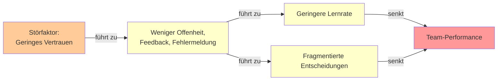
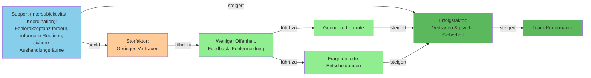
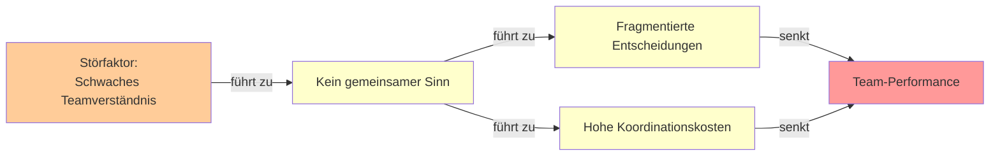
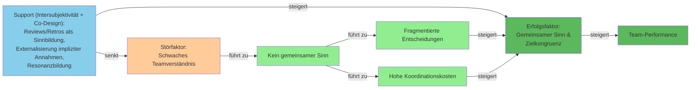
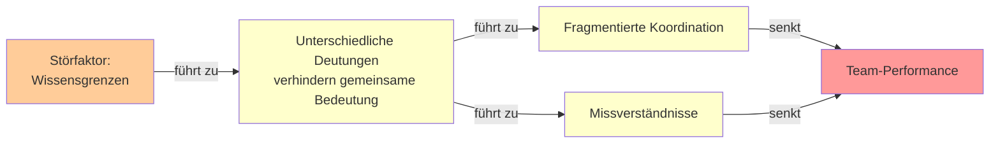
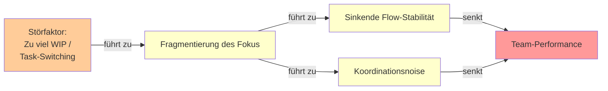
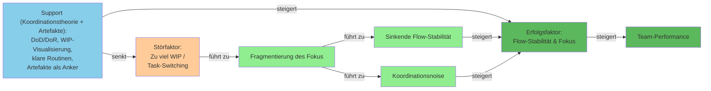
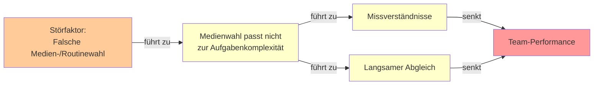
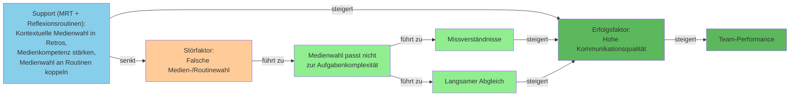
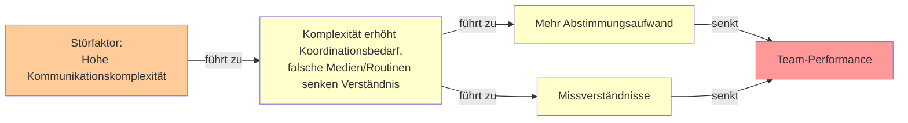

# Wirkmechanismen und Supportmaßnahmen zur Steigerung der Team-Performance
**Theoretische Fundierung:** Media Richness Theory (MRT), Koordinationstheorie, Intersubjektivität, Co-Design/Co-Creation, Boundary Objects/Spanner (Carlile)

---

## Prio 1: Vertrauen → Team-Performance

**Störfaktor:** Geringes Vertrauen / niedrige psychologische Sicherheit  
**Wirkmechanismus:** Weniger Offenheit, Feedback und Fehlermeldung → geringere Lernrate  
**Support:** Intersubjektivität + Koordination

### Reference Model (ohne Support)


### Impact Model (mit Support)


---

## Prio 2: Teamverständnis → Zielkongruenz

**Störfaktor:** Schwaches Teamverständnis / fehlende Zielkongruenz  
**Wirkmechanismus:** Kein gemeinsamer Sinn → fragmentierte Entscheidungen → Koordinationskosten  
**Support:** Intersubjektivität + Co-Design

### Reference Model (ohne Support)


### Impact Model (mit Support)

### Reference Model (ohne Support)


### Impact Model (mit Support)
```mermaid
graph LR
    Stoer[Störfaktor:<br/>Wissensgrenzen] -->|abgeschwächt| Mech[Unterschiedliche Deutungen<br/>verhindern gemeinsame Bedeutung]
    
    Support[\"Support (Carlile + Boundary Objects/Spanner + Co-Creation):<br/>Boundary Objects etablieren,<br/>Boundary Spanner einsetzen,<br/>Wissenstransformation\"] -->|senkt| Stoer
    Support -->|steigert| Ziel[Erfolgsfaktor:<br/>Gemeinsame Bedeutung<br/>über Grenzen]
    
    Mech -->|führt zu| Out1[Fragmentierte Koordination]
    Mech -->|führt zu| Out2[Missverständnisse]
    Out1 -->|steigert| Ziel
    Out2 -->|steigert| Ziel
    Ziel -->|steigert| Perf[Team-Performance]
    
    style Stoer fill:#ffcc99
    style Support fill:#87ceeb
    style Mech fill:#90ee90
    style Out1 fill:#90ee90
    style Out2 fill:#90ee90
    style Ziel fill:#5cb85c
    style Perf fill:#5cb85c
```
### Reference Model (ohne Support)


### Impact Model (mit Support)


### Reference Model (ohne Support)


### Impact Model (mit Support)

    
### Reference Model (ohne Support)


### Impact Model (mit Support)
```mermaid
graph LR
    Stoer[Störfaktor:<br/>Hohe Kommunikationskomplexität] -->|führt zu| Mech[Komplexität erhöht Koordinationsbedarf,<br/>falsche Medien/Routinen senken Verständnis]
    
    Support[\"Support (MRT + Koordinationstheorie):<br/>Medium-Aufgabe-Passung reflektieren,<br/>synchrone/reichere Medien,<br/>Koordinationsroutinen priorisieren\"] -->|senkt| Stoer
    Support -->|steigert| Ziel[Erfolgsfaktor:<br/>Reduzierte<br/>Kommunikationskomplexität]
    
    Mech -->|führt zu| Out1[Mehr Abstimmungsaufwand]
    Mech -->|führt zu| Out2[Missverständnisse]
    Out1 -->|steigert| Ziel
    Out2 -->|steigert| Ziel
    Ziel -->|steigert| Perf[Team-Performance]
    
    style Stoer fill:#ffcc99
    style Support fill:#87ceeb
    style Mech fill:#90ee90
    style Out1 fill:#90ee90
    style Out2 fill:#90ee90
    style Ziel fill:#5cb85c
    style Perf fill:#5cb85c
```

---

## Quellen

- **Carlile, P. R. (2002).** A pragmatic view of knowledge and boundaries: Boundary objects in new product development. *Organization Science, 13*(4), 442-455.
- **Daft, R. L., & Lengel, R. H. (1986).** Organizational information requirements, media richness and structural design. *Management Science, 32*(5), 554-571.
- **Dingsøyr, T., Moe, N. B., & Seim, E. A. (2018).** Coordinating knowledge work in multiteam programs: Findings from a large-scale agile development program. *Project Management Journal, 49*(6), 64-77.
- **Ehkirch, Q., & Matsumae, A. (2024).** Understanding the influence of interpersonal factors on interactions in co-design through intersubjectivity: a systematic literature review. *Design Science, 10*, e4.
- **Okhuysen, G. A., & Bechky, B. A. (2009).** 10 coordination in organizations: An integrative perspective. *Academy of Management Annals, 3*(1), 463-502.
- **Schmidt, T. S., Böhmer, A. I., Wallisch, A., Paetzold, K., & Lindemann, U. (2017).** Media richness theory in agile development. In *23rd Conference on Engineering, Technology and Innovation (ICE/TMC)*, Madeira, Portugal (pp. 27-29).

---

**Priorisierungslogik:**
1. **Hebelwirkung** – Welcher Störfaktor blockiert mehrere nachgelagerte Faktoren?
2. **Beeinflussbarkeit** – Wie gut kann das Team den Faktor direkt steuern?
3. **Messbarkeit** – Wie schnell sieht man Wirkung?
4. **Quellen-Fundierung** – Wie stark ist der Mechanismus theoretisch belegt?
